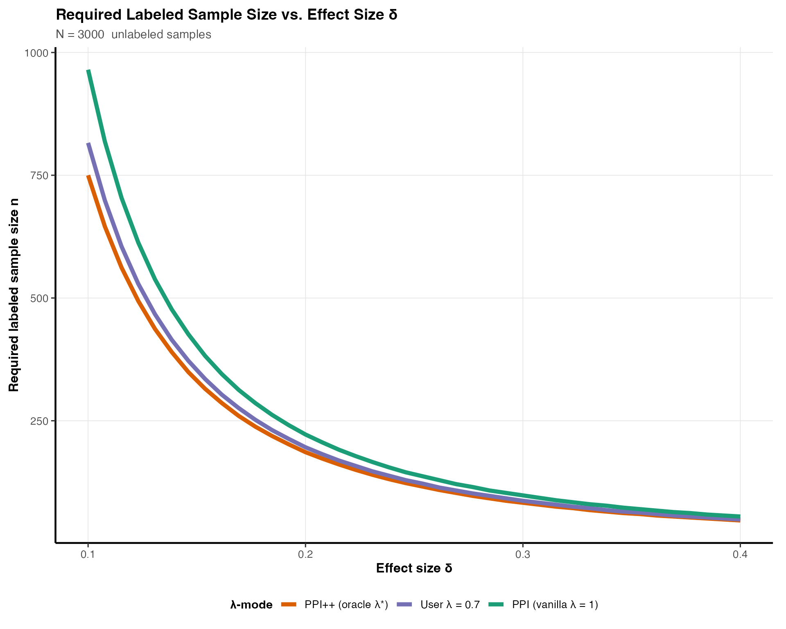

# Detailed Dive: Sample Size & Metrics Interface

## What this vignette covers

This is the **detailed dive** behind the quickstart:

- How
  [`power_ppi_mean()`](https://yiqunchen.github.io/pppower/reference/power_ppi_mean.md)
  works for mean estimation
- How to feed prediction metrics (MSE, $`R^2`$, sensitivity/specificity)
  instead of raw moments
- How to plan odds-ratio and relative-risk studies with
  [`power_ppi_2x2()`](https://yiqunchen.github.io/pppower/reference/power_ppi_2x2.md)
- Short, focused code blocks you can copy/paste

## Core call shape (reference)

``` r

power_ppi_mean(
  delta, N, n = NULL,
  power = 0.80, alpha = 0.05,
  lambda_mode = c("vanilla", "oracle", "user"),
  # mean inputs (choose one path)
  sigma_y2, sigma_f2, cov_y_f,
  var_f, var_res,
  metrics, metric_type
)
```

Only pass what you need for your path (moments **or** metrics).

## Mean mode with direct moments

``` r

delta  <- 0.20
N      <- 3000
alpha  <- 0.05
power  <- 0.80

sigma_y2 <- 1.00
sigma_f2 <- 0.40
cov_y_f  <- 0.15

power_ppi_mean(
  delta      = delta,
  N          = N,
  n          = NULL,
  power      = power,
  lambda_mode = "vanilla",
  sigma_y2   = sigma_y2,
  sigma_f2   = sigma_f2,
  cov_y_f    = cov_y_f
)
#> [1] 222

power_ppi_mean(
  delta      = delta,
  N          = N,
  n          = NULL,
  power      = power,
  lambda_mode = "oracle",
  sigma_y2   = sigma_y2,
  sigma_f2   = sigma_f2,
  cov_y_f    = cov_y_f
)
#> [1] 186
```

## Mean mode with prediction metrics

``` r

metrics <- list(
  type    = "continuous",
  var_y   = 1.00,   # total outcome variance
  mse     = 0.20,   # very strong model (small residual error)
  var_f   = 0.80,   # predictions have high variance
  cov_y_f = 0.70,   # very high correlation model
  m_obs   = 500
)

power_ppi_mean(
  delta       = 0.15,
  N           = 520,
  n           = NULL,
  power       = 0.80,
  lambda_mode = "vanilla",
  metrics     = metrics,
  metric_type = "continuous"
)
#> [1] 151

power_ppi_mean(
  delta       = 0.15,
  N           = 520,
  n           = NULL,
  power       = 0.80,
  lambda_mode = "oracle",
  metrics     = metrics,
  metric_type = "continuous"
)
#> [1] 124
```

`m_obs` is the labeled size used to estimate the metrics; finite-sample
corrections keep the derived moments feasible.

## Binary metrics (confusion matrix or sens/spec)

``` r

metrics <- list(
  type = "classification",
  # Confusion matrix (strong classifier)
  tp = 225,   # true positives
  fp =  25,   # false positives
  fn =  25,   # false negatives
  tn = 225,   # true negatives

  # Total observed labeled data used to compute the metrics
  m_obs = 500
)

# For reference:
# p_y = (tp + fn) / m_obs = (225 + 25)/500 = 0.50  (balanced)
# accuracy = (tp + tn)/500 = 450/500 = 0.90

# PPI sample-size calculation, λ=1
power_ppi_mean(
  delta       = 0.15,
  N           = 520,
  n           = NULL,
  power       = 0.80,
  lambda_mode = "vanilla",
  metrics     = metrics,
  metric_type = "classification"
)
#> [1] 43

# `PPI++` oracle-λ
power_ppi_mean(
  delta       = 0.15,
  N           = 520,
  n           = NULL,
  power       = 0.80,
  lambda_mode = "oracle",
  metrics     = metrics,
  metric_type = "classification"
)
#> [1] 35
```

For binary outcomes, the helper computes prevalence and prediction
prevalence from the confusion matrix and maps them to
$`\mathrm{Var}(f)`$ and $`\mathrm{Cov}(Y,f)`$.

## 2x2 tables: odds ratio and relative risk

``` r

power_ppi_2x2(
  p_exp          = 0.35,
  p_ctrl         = 0.20,
  N              = 500,
  power          = 0.80,
  sens           = 0.85,
  spec           = 0.85,
  effect_measure = "OR"
)
#> [1] 203

power_ppi_2x2(
  p_exp          = 0.35,
  p_ctrl         = 0.20,
  N              = 500,
  power          = 0.80,
  sens           = 0.85,
  spec           = 0.85,
  effect_measure = "RR"
)
#> [1] 210
```

Use `effect_measure = "OR"` for an odds-ratio design framed through a
logistic contrast, or `effect_measure = "RR"` for a relative-risk design
based on the delta method applied to the arm-specific PPI estimates.

## Regression-Mode Sample Size — OLS

We now demonstrate the **regression contrast** mode.

Generate Data:

``` r

p    <- 4
n_l  <- 400
n_u  <- 3000
beta <- c(0.7, -0.5, 0.2, 1.0)

X_l <- matrix(rnorm(n_l*p), n_l, p)
X_u <- matrix(rnorm(n_u*p), n_u, p)

Y_l <- drop(X_l %*% beta + rnorm(n_l, sd = 0.7))
f_l <- drop(X_l %*% beta + rnorm(n_l, sd = 0.6))
f_u <- drop(X_u %*% beta + rnorm(n_u, sd = 0.6))
```

Construct `PPI++` blocks for sandwich variance estimators:

``` r

blocks <- compute_ppi_blocks(
  model_type = "ols",
  X_l = X_l, Y_l = Y_l, f_l = f_l,
  X_u = X_u, f_u = f_u,
  beta = beta
)
```

Solve sample size for contrast $`c^\top \beta`$:

``` r

c_vec <- c(0, 1, 0, 0)
delta <- as.numeric(t(c_vec) %*% beta)

power_ppi_regression(
  delta       = delta,
  N           = n_u,
  n           = NULL,
  power       = 0.90,
  lambda_mode = "vanilla",
  c           = c_vec,
  H_L         = blocks$H_L,
  H_U         = blocks$H_U,
  Sigma_YY    = blocks$Sigma_YY,
  Sigma_ff_l  = blocks$Sigma_ff_l,
  Sigma_ff_u  = blocks$Sigma_ff_u,
  Sigma_Yf    = blocks$Sigma_Yf
)
#> [1] 35

power_ppi_regression(
  delta       = delta,
  N           = n_u,
  n           = NULL,
  power       = 0.90,
  lambda_mode = "oracle",
  c           = c_vec,
  H_L         = blocks$H_L,
  H_U         = blocks$H_U,
  Sigma_YY    = blocks$Sigma_YY,
  Sigma_ff_l  = blocks$Sigma_ff_l,
  Sigma_ff_u  = blocks$Sigma_ff_u,
  Sigma_Yf    = blocks$Sigma_Yf
)
#> [1] 23
```

## Regression-Mode Sample Size — GLM: Logistic Regression

(We follow similar steps as described in OLS case above)

``` r

p    <- 3
n_l  <- 500
n_u  <- 2500
beta <- c(1.2, -0.6, 0.5)

X_l <- matrix(rnorm(n_l*p), n_l, p)
X_u <- matrix(rnorm(n_u*p), n_u, p)

eta_l <- drop(X_l %*% beta)
eta_u <- drop(X_u %*% beta)

prob_l <- plogis(eta_l)
prob_u <- plogis(eta_u)

Y_l <- rbinom(n_l, 1, prob_l)

f_l <- plogis(eta_l + rnorm(n_l, sd = 1.5))
f_u <- plogis(eta_u + rnorm(n_u, sd = 1.5))
```

Construct `PPI++` blocks for sandwich variance estimators similar to
previous OLS case:

``` r

blocks_glm <- compute_ppi_blocks(
  model_type = "glm",
  family     = "binomial",
  X_l = X_l, Y_l = Y_l, f_l = f_l,
  X_u = X_u, f_u = f_u,
  beta = beta
)
```

Then solve for sample size:

``` r

c_vec <- c(1, 0, 0)
delta <- as.numeric(t(c_vec) %*% beta)

power_ppi_regression(
  delta       = delta,
  N           = n_u,
  n           = NULL,
  power       = 0.80,
  lambda_mode = "vanilla",
  c           = c_vec,
  H_L         = blocks_glm$H_L,
  H_U         = blocks_glm$H_U,
  Sigma_YY    = blocks_glm$Sigma_YY,
  Sigma_ff_l  = blocks_glm$Sigma_ff_l,
  Sigma_ff_u  = blocks_glm$Sigma_ff_u,
  Sigma_Yf    = blocks_glm$Sigma_Yf
)
#> [1] 60

power_ppi_regression(
  delta       = delta,
  N           = n_u,
  n           = NULL,
  power       = 0.80,
  lambda_mode = "oracle",
  c           = c_vec,
  H_L         = blocks_glm$H_L,
  H_U         = blocks_glm$H_U,
  Sigma_YY    = blocks_glm$Sigma_YY,
  Sigma_ff_l  = blocks_glm$Sigma_ff_l,
  Sigma_ff_u  = blocks_glm$Sigma_ff_u,
  Sigma_Yf    = blocks_glm$Sigma_Yf
)
#> [1] 41
```

## Handling infeasible cases

If the required labeled ($`n`$) exceeds the unlabeled ($`N`$), the
function throws an error by default (`mode = "error"`):

``` r

out <- power_ppi_mean(
  delta = 0.03,
  N     = 1000,
  n     = NULL,
  power = 0.80,
  sigma_y2 = 1,
  sigma_f2 = 0.2,
  cov_y_f  = 0.05,
  mode = "error"
)
#> Error:
#> ! Required n = 8710 exceeds N = 1000.
```

Switch to `mode = "cap"` to get an estimate of power at $`n = N`$:

``` r

out <- power_ppi_mean(
  delta = 0.03,
  N     = 1000,
  n     = NULL,
  power = 0.80,
  sigma_y2 = 1,
  sigma_f2 = 0.2,
  cov_y_f  = 0.05,
  mode = "cap"
)

out
#> [1] 1000
#> attr(,"achieved_power")
#> [1] 0.1566547
attr(out, "achieved_power")
#> [1] 0.1566547
```

## Power Curve Visualization

This chunk visualizes how required ($`n`$) decreases as effect size
grows, and how oracle $`\lambda`$ for `PPI++` estimator provides a clear
reduction in sample size estimations over vanilla PPI:

``` r

delta_grid <- seq(0.10, 0.40, length.out = 40)

## Shared parameters (mean-estimation case)
N       <- 3000
sy2     <- 1.0      # Var(Y)
sf2     <- 0.4      # Var(f)
cyf     <- 0.15     # Cov(Y, f)
lambda_user_value <- 0.70   # example user-specified λ

## Compute required n for each λ mode
results <- lapply(delta_grid, function(d) {
  data.frame(
    delta = d,
    vanilla = power_ppi_mean(
      delta       = d,
      N           = N,
      n           = NULL,
      power       = 0.80,
      lambda_mode = "vanilla",
      sigma_y2    = sy2,
      sigma_f2    = sf2,
      cov_y_f     = cyf
    ),
    oracle = power_ppi_mean(
      delta       = d,
      N           = N,
      n           = NULL,
      power       = 0.80,
      lambda_mode = "oracle",
      sigma_y2    = sy2,
      sigma_f2    = sf2,
      cov_y_f     = cyf
    ),
    user = power_ppi_mean(
      delta       = d,
      N           = N,
      n           = NULL,
      power       = 0.80,
      lambda_mode = "user",
      lambda_user = lambda_user_value,
      sigma_y2    = sy2,
      sigma_f2    = sf2,
      cov_y_f     = cyf
    )
  )
})

df <- bind_rows(results) |>
  pivot_longer(cols = c("vanilla", "oracle", "user"),
               names_to = "mode",
               values_to = "n")

ggplot(df, aes(delta, n, color = mode)) +
  geom_line(linewidth = 1.8) +
  scale_color_manual(
    values = c(
      vanilla = "#1B9E77",
      oracle  = "#D95F02",
      user    = "#7570B3"
    ),
    labels = c(
      vanilla = "PPI (vanilla λ = 1)",
      oracle  = "PPI++ (oracle λ*)",
      user    = paste0("User λ = ", lambda_user_value)
    )
  ) +
  labs(
    title = "Required Labeled Sample Size vs. Effect Size δ",
    subtitle = paste("N =", N, " unlabeled samples"),
    y = "Required labeled sample size n",
    x = "Effect size δ",
    color = "λ-mode"
  ) +
  theme_pppower(base_size = 12)
```



## Summary

This vignette demonstrated:

- How to compute PPI / `PPI++` sample size for mean estimation and
  regression.
- How to use direct moments or prediction metrics (continuous or
  classification).
- How to incorporate OLS or GLM models into contrast-based inference.
- When sample sizes become infeasible and how to handle caps.
- How $`\lambda`$ affects the required labeled sample size.

`PPI++` typically yields the smallest labeled sample size, especially
when the prediction model is strong and the correlation (
$`\mathrm{Cov}(Y,f(X))`$ ) is high.
